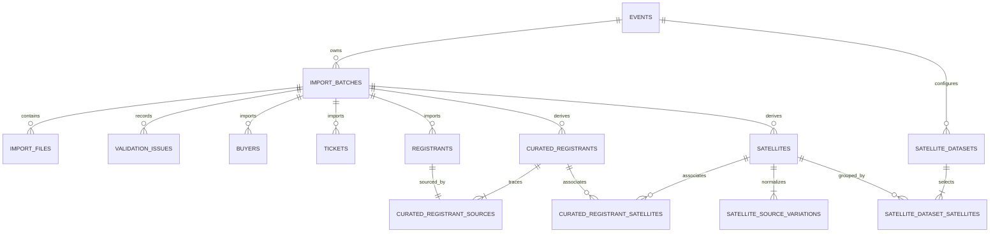

# Current Database Structure

## Storage and ownership

The application uses MySQL 8 through SQLAlchemy 2.x and PyMySQL. The canonical
typed schema is in `app/models.py`, and Alembic revisions in `migrations/`
exclusively own schema creation and upgrades. `DATABASE_URL` supplies all
connection credentials.

All tables use InnoDB, `utf8mb4`, and `utf8mb4_unicode_ci`. Analytics are
resolved through the selected Event's one active import batch:

```text
Event
  -> Active Import Batch
      -> immutable imported rows
      -> rebuildable curated rows
```

The current schema has fourteen application tables:

1. `events`
2. `import_batches`
3. `import_files`
4. `validation_issues`
5. `buyers`
6. `tickets`
7. `registrants`
8. `curated_registrants`
9. `curated_registrant_sources`
10. `satellites`
11. `satellite_source_variations`
12. `curated_registrant_satellites`
13. `satellite_datasets`
14. `satellite_dataset_satellites`

## Relationship diagram



`buyers` to `tickets` and `tickets` to `registrants` are batch-scoped logical
relationships using source identifiers. They are validated during import.

## Source and import tables

### `events`

| Column | Type | Rule |
|---|---|---|
| `id` | BIGINT UNSIGNED | Auto-increment primary key |
| `name` | VARCHAR(160) | Required |
| `event_date` | DATE | Nullable event date |
| `participant_target` | INTEGER | Nullable, non-negative integer |
| `created_at`, `updated_at` | DATETIME | Naive operational timestamps |

Event Date and Participant Target are Event-scoped settings. A null or zero
target produces an unconfigured progress state.

### `import_batches`

| Column | Type | Rule |
|---|---|---|
| `id` | INTEGER | Primary key |
| `event_id` | INTEGER | FK to `events`, cascade delete |
| `event_slug`, `event_name` | VARCHAR | Source Event identity |
| `status` | VARCHAR | `validating`, `invalid`, `validated`, `processing`, `active`, `inactive`, or `failed` |
| `created_at`, `processed_at`, `activated_at` | DATETIME | Lifecycle timestamps |
| `error_message` | TEXT | Nullable sanitized failure message |

The stored generated column `active_event_id` equals `event_id` only while the
status is `active`; it is otherwise `NULL`. A unique constraint on that column
allows unlimited historical batches while preventing two active batches for one
Event.

### `import_files`

Stores one `tickets`, `buyers`, and `registrants` file per batch, including the
filename, private staged path, validation status, detected export type, row
counts, duplicate count, relationship issue count, and warning count.

Important constraints:

```text
batch_id -> import_batches.id ON DELETE CASCADE
UNIQUE(batch_id, export_type)
```

### `validation_issues`

Stores import-quality errors and warnings:

```text
id, batch_id, severity, category, entity_type,
source_row, source_identifier, message
```

This table answers “was the upload valid and internally consistent?” Normal
deduplication results are exposed through the curation tables, not duplicated
as validation issues.

### `buyers`

```text
id, batch_id, source_id, event_slug, buyer_reference,
payment_status, quantity, source_data_json
```

`UNIQUE(batch_id, buyer_reference)` protects the authoritative buyer identity.

### `tickets`

```text
id, batch_id, source_id, event_slug, ticket_code, control_number,
buyer_reference, ticket_status, payment_status, check_in_at, source_data_json
```

`UNIQUE(batch_id, ticket_code)` protects the authoritative ticket identity.

### `registrants`

This is the preserved imported registration truth. Curation never updates or
deletes these rows.

Identity and registration fields:

```text
id, batch_id, source_id, event_slug, registration_code, ticket_code,
ticket_name_raw, ticket_status, first_name, last_name,
first_name_present, last_name_present, email_present, mobile_present,
registration_type, ticket_matched, checked_in
```

Demographic fields:

```text
gender_raw, life_stage_raw, birth_date_raw,
birth_month_raw, birth_year_raw
```

Church/satellite fields:

```text
b1g_satellite_hub_raw, b1g_satellite_raw,
b1g_satellite_specify_raw, attending_ccf_raw,
satellite_scope_raw, local_satellite_raw,
international_satellite_raw, affiliation, satellite_name, source_data_json
```

Important constraints:

```text
batch_id -> import_batches.id ON DELETE CASCADE
UNIQUE(batch_id, registration_code)
UNIQUE(batch_id, ticket_code)
registration_type IN ('participant', 'volunteer')
```

`source_data_json` is an immutable copy of the complete CSV row. It preserves
export-only fields—including contact and payment fields—for permission-protected
Admin Tables inspection while normalized columns continue driving application
logic. Historical rows are backfilled from preserved staged files when those
files remain available.

## Curated analytical tables

### `curated_registrants`

One row represents one analytically unique person inside one batch.

| Column group | Columns |
|---|---|
| Ownership | `id`, `event_id`, `batch_id` |
| Display/profile | `last_name`, `birth_date`, `birth_month`, `birth_year`, `gender`, `life_stage` |
| Match identity | `normalized_last_name`, `normalized_birth_month`, `normalized_birth_year`, `normalized_gender`, `dedupe_key` |
| Match status | `dedupe_complete`, `dedupe_status`, `missing_identity_fields` |
| Resolved analytics | `registration_type`, `registration_type_conflict`, `checked_in`, `source_registrant_count` |
| Audit | `created_at`, `updated_at` |

The complete match key is:

```text
normalized last name | normalized birth month | normalized birth year | normalized gender
```

`UNIQUE(batch_id, dedupe_key)` prevents duplicate curated groups. Incomplete
identities receive a source-record-specific key and therefore never merge.

### `curated_registrant_sources`

Traceability pivot from a curated person to every raw source registration:

```text
id, event_id, batch_id, curated_registrant_id, registrant_id, created_at
```

Constraints:

```text
curated_registrant_id -> curated_registrants.id ON DELETE CASCADE
registrant_id -> registrants.id ON DELETE CASCADE
UNIQUE(curated_registrant_id, registrant_id)
UNIQUE(batch_id, registrant_id)
```

### `satellites`

```text
id, event_id, batch_id, name, normalized_name, affiliation,
affiliation_conflict, source_record_count, created_at, updated_at
```

`UNIQUE(batch_id, normalized_name)` prevents capitalization/formatting aliases
from creating separate entities.

### `satellite_source_variations`

```text
id, event_id, batch_id, satellite_id, source_value,
normalized_source_value, affiliation, source_record_count, created_at
```

This preserves the spelling, source affiliation, and count behind every
normalized satellite.

### `curated_registrant_satellites`

Many-to-many association allowing one curated person to retain multiple valid
satellites:

```text
id, event_id, batch_id, curated_registrant_id, satellite_id, created_at
```

`UNIQUE(curated_registrant_id, satellite_id)` prevents duplicate associations.

## Satellite Dataset configuration tables

### `satellite_datasets`

One row is a reusable Event-owned satellite target group:

```text
id, event_id, name, participant_target, created_at, updated_at
```

Important constraints:

```text
event_id -> events.id ON DELETE CASCADE
participant_target >= 0
UNIQUE(event_id, name)
UNIQUE(event_id, id)
```

Names use the schema's case-insensitive Unicode collation and are unique only
within one Event. Participant totals are calculated from the active batch and
are not stored in this table.

### `satellite_dataset_satellites`

Many-to-many selection of existing normalized satellite rows:

```text
id, event_id, satellite_dataset_id, satellite_batch_id,
satellite_id, created_at
```

Composite foreign keys require both the dataset and satellite to belong to the
same Event. `satellite_batch_id` makes the batch-scoped satellite ownership
explicit. Both parents use `ON DELETE CASCADE`, so deleting a dataset removes
only its mappings, while a derived satellite rebuild cannot leave orphan links.

```text
UNIQUE(satellite_dataset_id, satellite_id)
```

A satellite may appear in multiple datasets. On active-batch replacement,
matching selections are moved to the new batch's existing satellite rows using
the canonical `satellites.normalized_name`; no duplicate satellite catalog is
created. A selection absent from the new batch remains historical and counts
zero until a later import contains that identity again.

## Isolation, cascading, and indexes

All derived rows carry both `event_id` and `batch_id`. Composite foreign keys
reject Event/batch mismatches, source mappings across batches, and satellite
pivots across ownership boundaries. Dashboard and drill-down queries
additionally start from the selected Event's active batch.

Deleting an Event cascades to its batches. Deleting a batch cascades to its raw
and curated children. Rebuilding one batch deletes and replaces only that
batch's derived records. Satellite Dataset mappings with matching normalized
identities are restored around that rebuild.

Processed inactive batches remain eligible for activation, allowing the active
dashboard dataset to switch in either direction through import history. The web
application prevents deletion of the active batch and restricts batch deletion
to administrators.

Indexes cover active-batch resolution, batch/type/check-in dashboard counts,
common administrative status and gender filters, dedupe keys, mapping lookups
in both directions, satellite names, satellite pivots, dataset ownership,
dataset-to-satellite mappings, variations, and validation issue categories. See
`app/models.py` for exact index names.

## Migration and rebuild behavior

Application startup never mutates schema. Apply explicit revisions with:

```sh
.venv/bin/alembic upgrade head
```

The one-time `scripts/migrate_sqlite_to_mysql.py` utility preserves the existing
SQLite data and IDs. An explicit derived-data rebuild remains available:

```sh
.venv/bin/python scripts/rebuild_curation.py --batch-id 12
.venv/bin/python scripts/rebuild_curation.py --event-id 3
```

Rebuild is transactional, deterministic, and idempotent.

## Phase 3 derived analytics

The current Phase 3 aggregate analytics require no schema changes. Payment
method, Occupation, Dgroup, and Home Area values are extracted from immutable
`source_data_json`; payment status and check-in use the existing normalized raw
columns; person semantics come from the existing curated tables. Conservative
classifications are derived by `app/analytics.py` and do not overwrite source
records. Historical queries read each Event-owned batch as a separate snapshot,
and cross-Event comparison never treats scoped curated IDs as global identities.

If a later approved revenue or export-audit design requires persistence, it
must be introduced through a new Alembic migration with both MySQL and SQLite
test compatibility. No such schema has been approved or added in this iteration.
