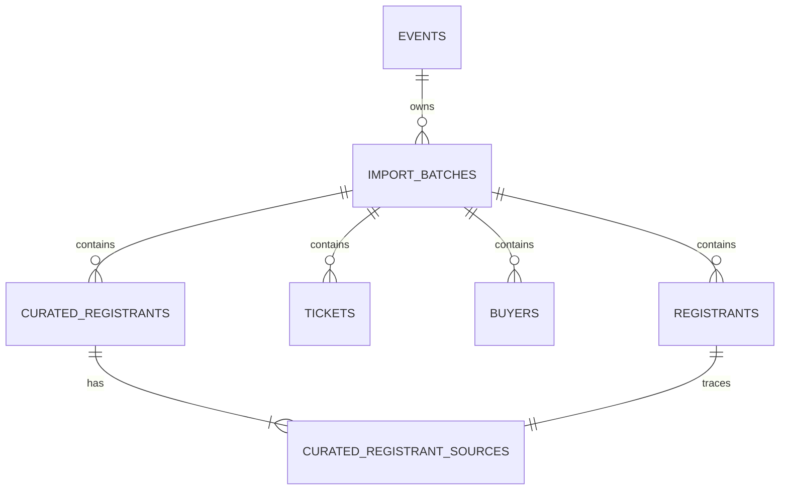

# Admin Tables — Database Tables and Query Pseudocode

## Purpose

This document describes the database tables read by the Admin Tables module and
the way the module builds its queries. It reflects the current implementation
in `app/admin_tables.py`, `app/routes.py`, and `app/static/admin_tables.js`.

Admin Tables is a read-only, administrator-protected inspection surface. It
does not update imported or curated records and does not provide exports.

## Module surfaces

| Admin Tables surface | URL dataset | Primary table | Supporting tables |
|---|---|---|---|
| Registrants | `registrants` | `registrants` | `import_batches`, `events` |
| Generated Tickets | `tickets` | `tickets` | `import_batches`, `events` |
| Buyers | `buyers` | `buyers` | `import_batches`, `events` |
| Curated Registrants | `curated` | `curated_registrants` | `import_batches`, `events`, `curated_registrant_sources`, `registrants` |
| Registration Sources drawer | N/A | `curated_registrant_sources` | `curated_registrants`, `registrants`, `import_batches`, `events` |
| Batch selector | N/A | `import_batches` | `events` through `event_id` ownership |

The navigation exposes Registrants, Generated Tickets, and Buyers. Curated
Registrants is a view within Registrants. Registration Sources is a detail
drawer opened from a curated row.

## Tables involved

### `events`

Provides the canonical Event identity and enforces the outermost scope for
every Admin Tables query.

Relevant fields:

| Field | Use in Admin Tables |
|---|---|
| `id` | Required Event boundary |
| `name` | Displayed Event name and searchable/filterable context column |

### `import_batches`

Owns each imported snapshot and connects raw import rows to an Event.

Relevant fields:

| Field | Use in Admin Tables |
|---|---|
| `id` | Batch selector, row scope, and displayed Batch value |
| `event_id` | Proves that a selected batch belongs to the selected Event |
| `status` | Displayed Batch Status and active-batch lookup |
| `event_name` | Batch selector metadata |
| `created_at` | Batch selector ordering and source import date |
| `activated_at` | Active-batch ordering |

### `registrants`

Stores one normalized registration row plus the complete source CSV row in
`source_data_json`. It is the primary table for the Registrants view and is
also read by the Curated Registrants and Registration Sources views.

The normalized columns supply the standard identity, registration,
demographic, satellite, import, and presence-flag columns. Unmapped source
columns are discovered from `source_data_json` and added to the column catalog
at query time.

Important Admin Tables fields include:

```text
id, batch_id, source_id, registration_code, ticket_code,
ticket_name_raw, ticket_status, registration_type,
first_name, last_name, gender_raw, life_stage_raw,
birth_date_raw, birth_month_raw, birth_year_raw,
affiliation, satellite_name, ticket_matched, checked_in,
event_slug, presence flags, source_data_json
```

The attestation-form value is read from the `source_data_json` property named
`Upload Your Accomplished Attestation Form Here`. The database returns the
stored value; browser code permits only valid HTTP or HTTPS URLs and renders
them as **View Attestation Form** links.

### `tickets`

Stores generated ticket rows and their complete source CSV records.

Important Admin Tables fields include:

```text
id, batch_id, source_id, ticket_code, control_number,
buyer_reference, ticket_status, payment_status,
check_in_at, event_slug, source_data_json
```

### `buyers`

Stores buyer rows and their complete source CSV records.

Important Admin Tables fields include:

```text
id, batch_id, source_id, buyer_reference,
payment_status, quantity, event_slug, source_data_json
```

Monetary and other export-only buyer fields remain unmodified inside
`source_data_json`. Admin Tables may expose those original values as dynamic
columns but does not assign accounting meaning to them.

### `curated_registrants`

Stores one curated person per Event and batch according to the curation rules.
It is the primary table for the Curated Registrants view.

Important Admin Tables fields include:

```text
id, event_id, batch_id, last_name,
birth_date, birth_month, birth_year, gender, life_stage,
normalized_last_name, normalized_birth_month,
normalized_birth_year, normalized_gender,
dedupe_key, dedupe_complete, dedupe_status,
missing_identity_fields, registration_type,
registration_type_conflict, checked_in,
source_registrant_count, created_at, updated_at
```

The first name displayed for a curated row comes from a representative raw
registration: the linked `registrants` row having the smallest registrant ID.

### `curated_registrant_sources`

Maps each curated person to the raw registration rows from which it was built.
It is used in two places:

1. to select a representative raw registration for the curated list; and
2. to load every linked raw registration in the Registration Sources drawer.

Relevant fields:

```text
event_id, batch_id, curated_registrant_id, registrant_id
```

The Event and batch fields are always checked during lineage retrieval. A
curated ID alone is never sufficient to retrieve another Event's source rows.

## Relationship overview



The `tickets.buyer_reference -> buyers.buyer_reference` and
`registrants.ticket_code -> tickets.ticket_code` relationships are validated
during import, but the main Admin Tables list queries do not join those tables.
Each list displays its own preserved dataset independently.

## Request and authorization flow

All page, data, and lineage endpoints apply the same access decision.

```text
FUNCTION can_access_admin_tables(request, current_user, configuration):
    IF ADMIN_TABLES_ENABLED is false:
        DENY

    IF authentication is enabled:
        REQUIRE current_user is authenticated
        REQUIRE current_user is administrator

    IF ADMIN_TABLES_AUTHORIZER is configured:
        REQUIRE ADMIN_TABLES_AUTHORIZER(request) returns true

    ALLOW
```

The page request then establishes Event and active-batch context.

```text
FUNCTION open_admin_table_page(event_id, navigation_dataset, requested_view, requested_batch):
    REQUIRE authorized Admin Tables access
    REQUIRE navigation_dataset is one of registrants, tickets, buyers

    event = FIND events WHERE id equals event_id
    IF event does not exist:
        RETURN 404

    active_batch = FIND newest import_batches
        WHERE event_id equals selected event
        AND status equals active
        ORDER BY activated_at descending, id descending
        TAKE first row

    IF navigation_dataset is registrants AND requested_view is curated:
        query_dataset = curated
    ELSE:
        query_dataset = navigation_dataset

    batch_scope = RESOLVE_BATCH_SCOPE(event_id, requested_batch, active_batch.id)
    batches = FIND import_batches
        WHERE event_id equals selected event
        ORDER BY id descending

    RENDER page with event, active batch, query dataset, batch scope, and batches
```

## Batch scope resolution

Batch scope is evaluated before columns or rows are queried.

```text
FUNCTION resolve_batch_scope(event_id, requested_batch, active_batch_id):
    IF requested_batch is missing, blank, or "active":
        RETURN active_batch_id

    IF requested_batch equals "all":
        RETURN ALL_BATCHES_FOR_SELECTED_EVENT

    REQUIRE requested_batch can be converted to an integer

    owned_batch = FIND import_batches
        WHERE id equals requested_batch
        AND event_id equals selected event

    IF owned_batch does not exist:
        REJECT request

    RETURN owned_batch.id
```

`all` removes only the single-batch predicate. The `events.id = selected
event_id` predicate remains, so it never means all Events.

## Column discovery

Each dataset starts with an allow-listed column catalog. Registrants, tickets,
and buyers then add source-only fields found in their JSON records.

```text
FUNCTION columns_for(dataset, event_id, batch_scope):
    IF dataset is curated:
        RETURN fixed curated column catalog

    REQUIRE dataset is registrants, tickets, or buyers
    columns = common context columns + fixed normalized dataset columns

    headers = DISTINCT JSON property names from dataset.source_data_json
        JOIN import_batches by record.batch_id
        WHERE batch belongs to selected event
        AND record is inside selected batch scope

    FOR EACH header in headers:
        IF header is already represented by a normalized column:
            CONTINUE

        key = deterministic slug(header) + short SHA-1 suffix
        type = conservatively infer date, number, or text from header
        expression = safely extract that exact JSON property

        IF dataset is registrants AND header is the attestation-form header:
            mark column visible by default
            mark renderer as attestation_form_link

        ADD allow-listed dynamic column definition

    RETURN columns
```

Production MySQL discovers keys through `JSON_KEYS` and `JSON_TABLE`, then
extracts values with `JSON_EXTRACT` and `JSON_UNQUOTE`. Isolated SQLite tests
use `json_each` and the equivalent JSON extraction expression.

## Base record sets

### Registrants, tickets, and buyers

```text
BASE_RECORD_SET(dataset):
    FROM selected dataset AS record
    JOIN import_batches AS batch ON batch.id equals record.batch_id
    JOIN events AS event ON event.id equals batch.event_id
```

### Curated Registrants

```text
BASE_CURATED_RECORD_SET:
    FROM curated_registrants AS record
    JOIN import_batches AS batch ON batch.id equals record.batch_id
    JOIN events AS event ON event.id equals record.event_id
    LEFT JOIN registrants AS representative ON representative.id equals:
        MINIMUM registrant_id from curated_registrant_sources
        WHERE curated_registrant_id equals record.id
```

The main predicates applied to either base set are:

```text
event.id equals selected_event_id

IF one batch is selected:
    record.batch_id equals selected_batch_id
ELSE IF there is no active batch:
    always false
ELSE IF all Event batches are selected:
    no additional batch predicate
```

## Main list query

The data endpoint accepts:

```text
batch, search (or q), filters, sort, direction, page, per_page
```

Current page-size choices are 25, 50, and 100; the default is 50. Search is
limited to 200 characters, at most 20 filters are accepted, and multi-select
filters accept at most 50 values.

```text
FUNCTION query_admin_table(dataset, event_id, active_batch_id, request):
    batch_scope = RESOLVE_BATCH_SCOPE(...)
    columns = COLUMNS_FOR(dataset, event_id, batch_scope)
    column_map = INDEX columns BY safe column key

    filters = PARSE_AND_VALIDATE_FILTERS(request.filters, column_map)
    search = TRIM_AND_LIMIT(request.search, 200 characters)
    page = MAX(integer request.page or 1, 1)
    per_page = request.per_page IF in [25, 50, 100] ELSE 50

    default_sort = first column marked as default
    sort = request.sort IF it names an allow-listed sortable column
           ELSE default_sort
    direction = request.direction IF asc or desc ELSE asc

    base_records = BASE_RECORD_SET(dataset)
    conditions = [event.id equals selected event]

    IF batch_scope is one batch:
        ADD record.batch_id equals selected batch
    ELSE IF active scope has no active batch:
        ADD always-false condition

    category_option_scope = COPY current Event and batch conditions

    IF search is present:
        ADD one grouped OR condition:
            case-insensitive text of each searchable column contains search

    FOR EACH validated filter:
        ADD FILTER_CLAUSE(allow-listed column expression, operator, value)
        ADD value through bound query parameters

    total = COUNT rows from base_records matching all conditions
    pages = MAX(ceiling(total / per_page), 1)
    page = MIN(page, pages)
    offset = (page - 1) * per_page

    rows = SELECT every allow-listed column expression
        FROM base_records
        WHERE all conditions
        ORDER BY allow-listed sort expression and direction,
                 record.id ascending as deterministic tie-breaker
        LIMIT per_page
        OFFSET offset

    category_options = QUERY_CATEGORICAL_OPTIONS(
        base_records,
        category_option_scope,
        select and boolean columns
    )

    RETURN public column metadata, rows, query state,
           categorical options, and pagination metadata
```

Column expressions never come directly from request values. Dataset names,
column names, operators, sort direction, page size, and batch ownership are
validated before a query is assembled. Filter and search values are supplied
as bound parameters.

## Search and filter pseudocode

```text
FUNCTION filter_clause(column, operator, value):
    REQUIRE operator is allowed for column.type

    IF operator is is_empty:
        MATCH null or trimmed empty text
    IF operator is is_not_empty:
        MATCH non-null and non-empty text
    IF operator is contains, starts_with, or ends_with:
        MATCH case-insensitive text pattern using bound value
    IF operator is equals or exact:
        VALIDATE and compare as boolean, number, date, or case-insensitive text
    IF operator is in:
        VALIDATE up to 50 values and compare against bound values
    IF operator is before, after, less_than, or greater_than:
        VALIDATE date or number and apply comparison
    IF operator is between:
        REQUIRE two valid date or number boundaries
    OTHERWISE:
        REJECT request
```

Supported operators by type:

| Type | Operators |
|---|---|
| Text | contains, equals, starts with, ends with, is empty, is not empty |
| Select | equals, in, is empty, is not empty |
| Boolean | equals |
| Date | exact, before, after, between, is empty, is not empty |
| Number | equals, greater than, less than, between, is empty, is not empty |

Categorical filter choices are loaded using only Event and batch scope. They do
not depend on the current global search or already-applied filters, so users can
change filter combinations without options disappearing.

## Registration Sources lineage query

Opening the Sources action performs two scoped reads.

```text
FUNCTION registration_sources(event_id, curated_id, batch_scope):
    curated = FIND curated_registrants
        JOIN events by curated.event_id
        JOIN import_batches by curated.batch_id
        LEFT JOIN representative registrant through the minimum linked registrant_id
        WHERE curated.id equals requested curated_id
        AND curated.event_id equals selected event
        AND, when one batch is selected, curated.batch_id equals selected batch

    IF curated does not exist:
        RETURN not found

    sources = FIND curated_registrant_sources AS link
        JOIN registrants AS raw ON raw.id equals link.registrant_id
        JOIN import_batches AS batch ON batch.id equals raw.batch_id
        JOIN events AS event ON event.id equals batch.event_id
        WHERE link.curated_registrant_id equals curated.id
        AND link.event_id equals selected event
        AND link.batch_id equals curated.batch_id
        ORDER BY raw.id ascending

    FOR EACH source row:
        PARSE raw.source_data_json as complete source values
        BUILD normalized values from non-empty normalized columns

    RETURN curated summary and linked source records
```

This query preserves Event ownership, batch snapshot semantics, and traceability
from a curated person back to every contributing immutable registration row.

## Response shape

The list endpoint returns machine-readable JSON in this conceptual form:

```text
{
    dataset,
    label,
    batch,
    columns: public column metadata without database expressions,
    column_options: categorical filter choices,
    rows,
    query: search/filter/sort state,
    pagination: page, pages, per_page, total, start, end,
                has_previous, has_next
}
```

Database expressions are removed from the public column metadata. The browser
receives only the column keys and capabilities it needs to render, filter, sort,
and manage visibility.

## Tables intentionally outside this module

The following tables are not queried by the current Admin Tables list or
lineage endpoints:

```text
users
import_files
validation_issues
satellites
satellite_source_variations
curated_registrant_satellites
satellite_datasets
satellite_dataset_satellites
```

They belong to authentication, Event Imports, Data Quality, satellite
analytics, or Satellite Dataset configuration. Their absence keeps Admin
Tables focused on the three required source exports and curated registrant
traceability.

## Implementation references

| Concern | Source |
|---|---|
| Route authorization and endpoints | `app/routes.py` |
| Column catalog, scoping, filtering, sorting, and pagination | `app/admin_tables.py` |
| Active-batch lookup | `app/aggregation.py` |
| Canonical table definitions and constraints | `app/models.py` |
| Client request state and table rendering | `app/static/admin_tables.js` |
| Page and lineage drawer markup | `app/templates/admin_table.html` |
| Behavior and boundary tests | `tests/test_phase1.py`, `tests/test_auth.py` |
